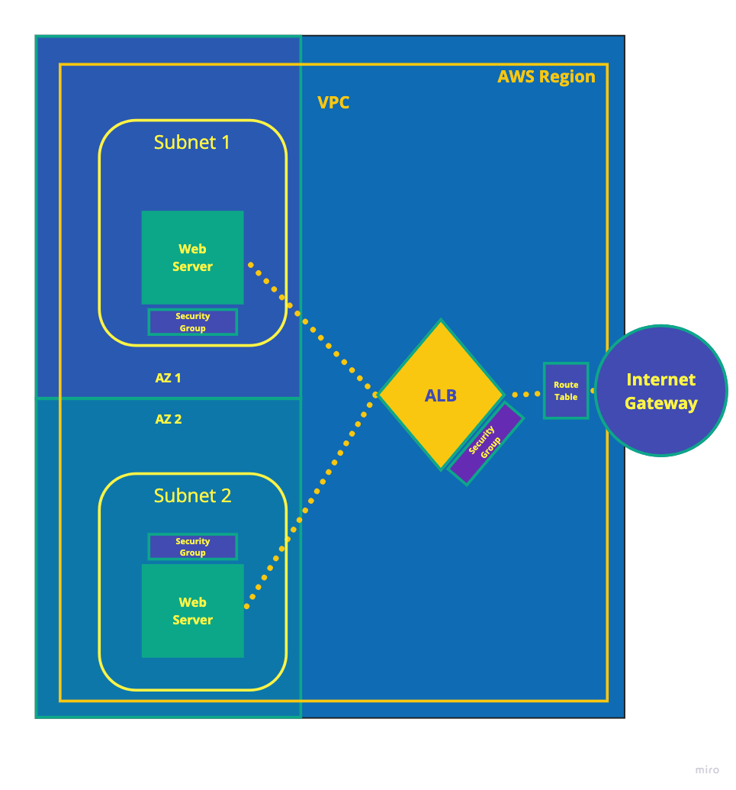

# Scalable Web Infrastructure with Terraform
## A sample project for Terraform and AWS

In this hands-on project, you will create a reusable scalable web application infrastructure using Terraform. You will start by prototyping and creating a Terraform project that can provision the required infrastructure. In the second part, you will modularize and refactor your code for reusability and deployments in multiple environments.

